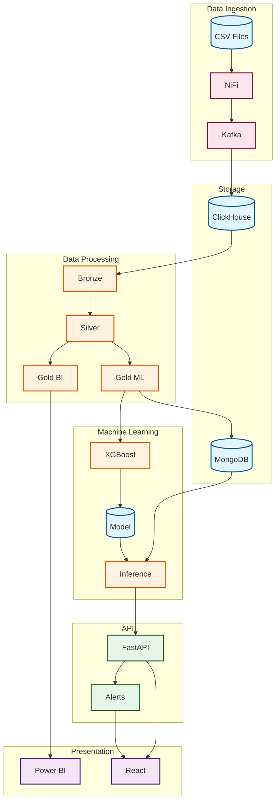
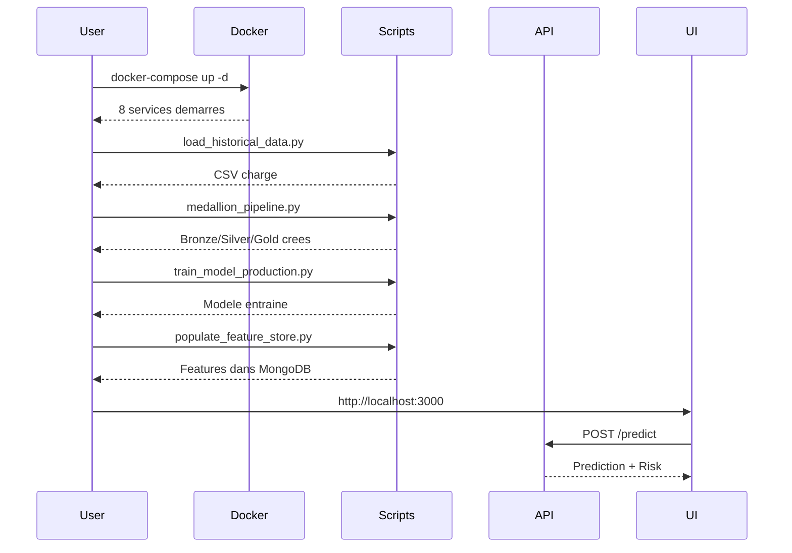

# Airline Data Pipeline

Plateforme ML end-to-end de prediction de retards aeriens utilisant une architecture Big Data moderne.

---

## Architecture Technique



---

## Services Docker

| Service | Image | Port | Description |
|---------|-------|------|-------------|
| Zookeeper | confluentinc/cp-zookeeper:7.5.0 | 2181 | Coordination Kafka |
| Kafka | confluentinc/cp-kafka:7.5.0 | 9092 | Message broker |
| NiFi | apache/nifi:1.23.2 | 8080 | Ingestion de donnees |
| ClickHouse | clickhouse/clickhouse-server:23.8 | 8123 | Base analytique |
| MongoDB | mongo:7.0 | 27017 | Feature store |
| ML API | python:3.11-slim | 8001 | Predictions FastAPI |
| ML UI | node:20-alpine | 3005 | Dashboard React |

---

## Architecture Medallion

```
BRONZE (Raw) --> SILVER (Cleaned) --> GOLD_BI (Dashboards)
                                  --> GOLD_ML (ML Features)
```

| Table | Engine | Usage |
|-------|--------|-------|
| bronze_flights | MergeTree | Donnees brutes CSV |
| silver_flights | ReplacingMergeTree | Donnees nettoyees |
| gold_bi | ReplacingMergeTree | Power BI / Dashboards |
| gold_ml_features | ReplacingMergeTree | Entrainement ML |
| ml_predictions | ReplacingMergeTree | Resultats predictions |

---

## Scripts Pipeline

| Script | Description |
|--------|-------------|
| load_historical_data.py | CSV vers ClickHouse |
| load_airports_gps.py | Coordonnees GPS |
| medallion_pipeline.py | Bronze vers Silver vers Gold |
| train_model_production.py | Entrainement XGBoost |
| populate_feature_store.py | ClickHouse vers MongoDB |
| kafka_to_clickhouse.py | Consumer Kafka temps reel |

---

## API Endpoints

| Endpoint | Methode | Description |
|----------|---------|-------------|
| /health | GET | Health check |
| /predict | POST | Prediction single |
| /predict/batch | POST | Predictions multiples |
| /predictions/history | GET | Historique |
| /predictions/statistics | GET | Statistiques |

---

## Interfaces

### React Dashboard (Port 3005)
- Dashboard, Prediction, Alerts, History
- Material-UI + TypeScript

### Monitoring Kafka (Local)
```bash
python realtime_app.py
```
- Affichage temps reel des messages Kafka
- Execution locale (pas dans Docker)

### Power BI
- Connecte a Gold BI
- Reporting et KPIs

---

## Feature Engineering

| Categorie | Features |
|-----------|----------|
| Identifiants | carrier_id, airport_id (CityHash64) |
| Target | delay_rate, is_delayed (seuil 20%) |
| Lag Pair | pair_lag1, pair_lag3_mean |
| Lag Airport | airport_lag1, airport_lag3_mean |
| Lag Carrier | carrier_lag1, carrier_lag3_mean |
| Cyclique | month_sin, month_cos |
| Saisonnier | is_summer, is_winter, is_holiday_season |

---

## Quick Start

```bash
# 1. Demarrer les services
docker-compose up -d

# 2. Charger les donnees
python scripts/load_historical_data.py

# 3. Pipeline Medallion
python scripts/medallion_pipeline.py

# 4. Entrainer le modele
python scripts/train_model_production.py

# 5. Peupler le feature store
python scripts/populate_feature_store.py

# 6. Monitoring temps reel (optionnel)
python realtime_app.py

# 7. Acceder aux interfaces
# React: http://localhost:3005
# API: http://localhost:8001/docs
```

---

## Workflow



---

## Metriques ML

| Metrique | Valeur |
|----------|--------|
| ROC-AUC (Val) | ~0.83 |
| ROC-AUC (Test) | ~0.86 |
| PR-AUC | ~0.75 |

### Seuils d'alerte

| Probabilite | Categorie |
|-------------|-----------|
| 0-50% | Low Risk |
| 50-70% | Medium Risk |
| 70-85% | High Risk |
| 85%+ | Critical |

---

## Points Cles

1. **Feature Engineering en SQL** - Coherence training/serving
2. **Hash-based Encoding** - CityHash64 pour IDs stables
3. **Architecture Medallion** - Tracabilite des donnees
4. **Temporal Split** - Evaluation realiste (pas de data leakage)
5. **Feature Store MongoDB** - Acces rapide aux features
6. **Alerting Integre** - Notifications automatiques
